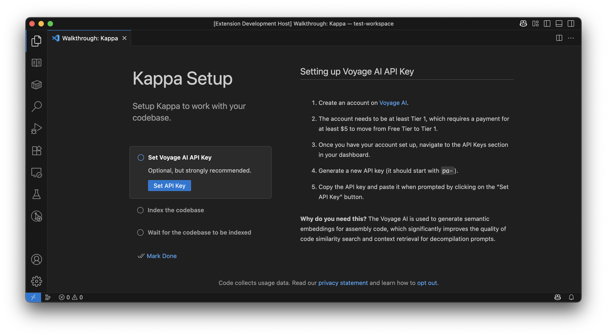
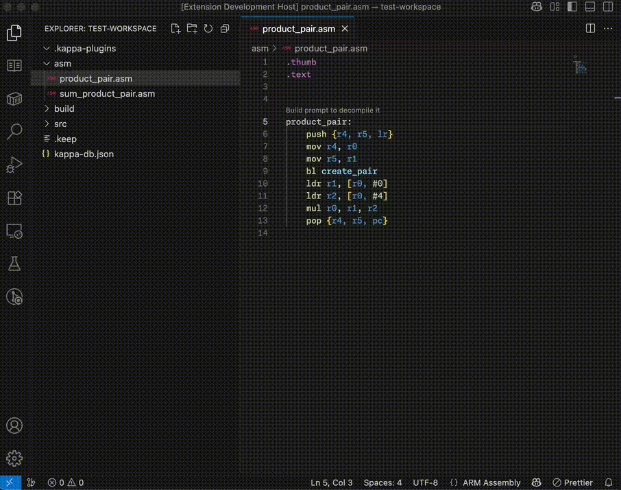
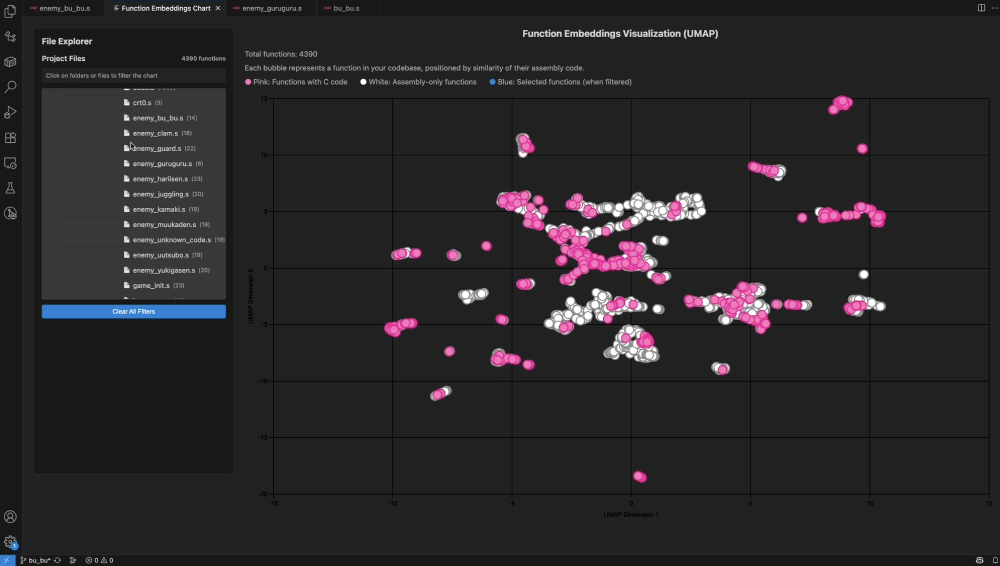
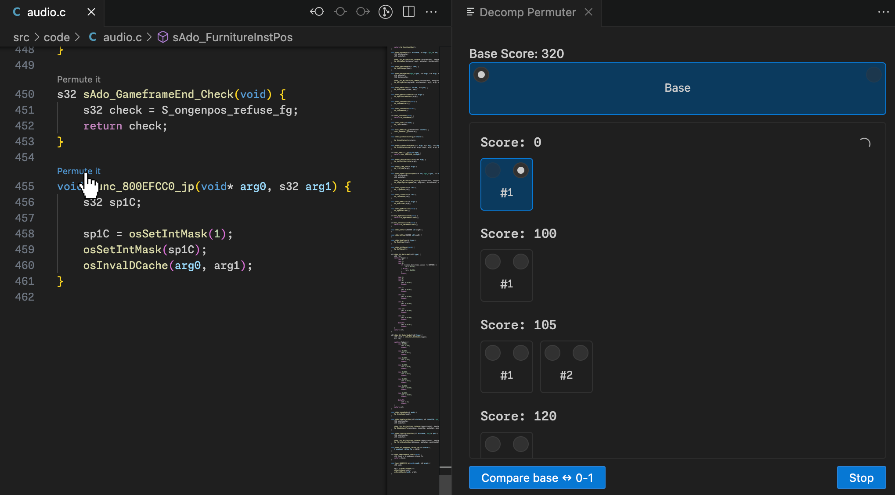
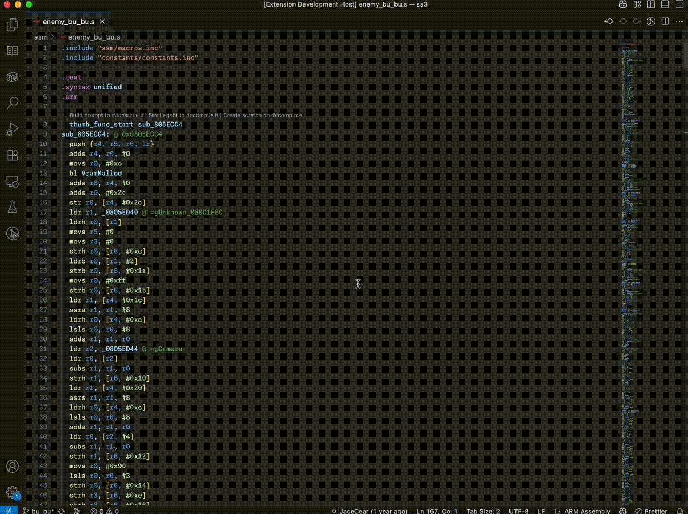

# Kappa


[](https://github.com/macabeus/kappa)
[](https://marketplace.visualstudio.com/items?itemName=macabeus.kappa)

Your decompiler buddy who lives on VS Code.

- **✨ AI Prompt Builder:** Craft high-quality prompts to guide AI in decompiling a function.
- **🤖 Agent Mode:** Automatically decompile a given function, until it reache 100% match.
- **🐍 Integration with popular decompilation toolings:** Create a scratch on [decomp.me](https://decomp.me/) in one click, call [m2c](https://github.com/matt-kempster/m2c), [decomp-permuter](https://github.com/simonlindholm/decomp-permuter) and [objdiff](https://github.com/encounter/objdiff) from VS Code easily.
- **🔌 Automated Code Fixes:** Use plugins to automatically update the code’s AST, eliminating repetitive tasks and correcting common errors.

> [📚 Learn how this project was developed on Substack](https://gambiconf.substack.com/p/development-journey-on-game-decompilation)

## ⚙️ Extension setup



Make sure to follow the Kappa Setup walkthrough to get the extension working on your project.

> :warning: This extensions runs only on single-root workspaces. Open a folder or workspace first to use it.

## ✨ AI Prompt Builder



Click on "Build prompt" to create a context-aware prompt for decompiling an assembly function. It automatically analyzes your codebase to provide the AI with accurate context for the task.

The prompt includes:

- Real examples from your codebase: Functions that have already been decompiled (found via Git history)
- Function signatures of dependencies used in the target assembly
- Clear instructions and formatting rules for the AI

## 🤖 Agent Mode

https://github.com/user-attachments/assets/f8f5c135-fd9b-494f-92fd-a69044318567

Click on "Start agent" to have VS Code Copilot automatically decompile the assembly function.

> **Note:** Make sure to have the "Agent" mode selected on GitHub Copilot before clicking on the code lens.

## 🎨 Commands

### Compare a symbol from two object files

Kappa bundles [`objdiff`](https://github.com/encounter/objdiff) into the extension. You can call it directly from the command palette by running `Compare a symbol from two object files`.

### Scatter Chart



You can plot a scatter chart to visualize clusters of functions with similar assembly code by running `Show chart`.

## 🔖 Language Model Tools

### `objdiff`

You can call [`objdiff`](https://github.com/encounter/objdiff) from the Copilot Chat to explain the diffs from a given function.

#### Example

- Calling `#objdiff` on the ask mode to explain the differences.

```markdown
#objdiff explain the differences on this function.
The current object file is at `sa3/build/bu_bu.o`.
The target object file is at `sa3/expected/bu_bu.o`
```

- Calling `#objdiff` on the agent mode to fix the differences for a function.

```markdown
Call #objdiff comparing the function `sub_805ECC4` with the expected assembly function, and fixes the gaps.

The current object file path is at `sa3/build/bu_bu.o` and the target object file path is at `sa3/expected/bu_bu.o`.

Make your changes and compile calling `make` to check if it's working.

Stop only when there are no more differences.
```

## 🐍 Integrations

### m2c

Decompile assembly functions using [m2c](https://github.com/matt-kempster/m2c) by clicking "Decompile with m2c" code lens above assembly functions.

### decomp-permuter



Generate code variations using [decomp-permuter](https://github.com/simonlindholm/decomp-permuter) by clicking "Permute it" above C functions. Compare different permutations in the side panel to find better variants. Score zero means that this variant compiles to an assembly that matches with the target one.

### decomp.me



Create a new scratch on [decomp.me](https://decomp.me/) instantly by clicking the code lens that appears above assembly functions. It automatically includes the type definitions from your code base which are used by the function and aren't on the context.

## 🔌 Kappa Plugins


**Kappa plugins** are scripts that transform the Abstract Syntax Tree (AST) of C/C++ code blocks. They can be used to:

- Fix common decompilation errors
- Avoid repetitive tasks

### Example Kappa Plugin Case

For instance: When decompiling [Sonic Advance 3](https://github.com/SAT-R/sa3) using AI, it kept messing up by using raw numbers instead of the proper Q notation. So, we can [`ApplyQNotationPlugin`](./example-kappa-plugins/ApplyQNotationPlugin.js) that catches assignments to `Vec32` using a raw number and replaces it with the Q format.

```cpp
// Before: Raw decompiled code
player.x = 256;

// After: ApplyQNotationPlugin transformation
player.x = Q(1);
```

Check more examples on [`./example-kappa-plugins`](./example-kappa-plugins).

### How to use the plugins

1. Add the plugins in a folder called `.kappa-plugins` from the workspace root.
2. Select a function
3. Run the action `Run Kappa Plugins`

## Contributing

- [Creating new plugins to use with the VS Code extension](./docs/create-your-own-kappa-plugin.md)
- [Developing the VS Code extension itself](./docs/developing-kappa-vscode-extension.md)
